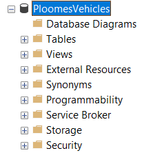

# VehiclesMinimalAPI
Minimal API para administrar um sistema de registro de automóveis. :car:	

Este projeto consiste em uma Web API, desenvolvida seguindo o paragima de Minimal APIs disponível pelo .NET 6.0 :grinning:. Nele é possível registrar e logar usuários através da autenticação utilizando Tokens, além de listar, criar, editar e excluir automóveis do banco de dados.

## Ferramentas e pacotes utilizados:
- [Visual Studio](https://visualstudio.microsoft.com/pt-br/)
- [Microsoft SQL Server](https://www.microsoft.com/pt-br/sql-server/sql-server-2019)
- [.NET 6.0](https://dotnet.microsoft.com/pt-br/download)
- [Microsoft.EntityFrameworkCore.SqlServer](https://www.nuget.org/packages/Microsoft.EntityFrameworkCore.SqlServer/)
- [Microsoft.EntityFrameworkCore.Tools](https://www.nuget.org/packages/Microsoft.EntityFrameworkCore.Tools)
- [MiniValidation](https://www.nuget.org/packages/MiniValidation/0.8.0?_src=template)
- [NetDevPack.Identity](https://www.nuget.org/packages/NetDevPack.Identity/6.0.5?_src=template)
- [Swashbuckle.AspNetCore](https://www.nuget.org/packages/Swashbuckle.AspNetCore/6.5.0?_src=template)

# Documentação:
## Como Executar o projeto :computer::
- 1: Primeiramente clone este repositório.
- 2: Tenha instalado na máquina o [Visual Studio](https://visualstudio.microsoft.com/pt-br/), o [Microsoft SQL Server](https://www.microsoft.com/pt-br/sql-server/sql-server-2019) e o [.NET 6.0](https://dotnet.microsoft.com/pt-br/download).
- 3: Abra o projeto no Visual Studio a partir do arquivo Solution ```VehiclesMinimalAPI.sln``` .
- 4: Abra o SQL Server.
- 5: Vá para o arquivo ```appsettings.json``` e adicione na chave ```DefaultConnection``` o nome da máquina/servidor local na tag ```{SUA_MAQUINA_AQUI_}```, não esquecendo de remover as chaves!
- 6: Salve o arquivo, abra o console de Gerenciador de Pacotes do Visual Studio e execute os seguintes comandos:
  - ```update-database -context NetDevPackAppDbContext``` e ```update-database -context MinimalContextDb``` .
- 7: Verifique se o banco de dados foi criado no SQL Server, conforme a imagem abaixo:

   
    
- 8: Execute o projeto, ele abrirá no navegador a API do Swagger conforme a imagem abaixo:
  - [Imagem do Swagger]
- 9: Por ter Autenticação, primeiramente é preciso registrar um usuário para ter acesso aos endpoints. Apenas o primeiro endpoint  GET que possui acesso livre, listando todos os automóveis disponíveis no banco de dados, conforme a imagem abaixo:
  - [Imagem imagem do endpoint get]
- 10: Vá até o endpoint POST de Cadastro e registre o seguinte usuário Admin. Não se esqueça de que esse modelo de usuário possui um padrão de e-mail e senhas, necessitando ter pelo menos uma letra em maiúsculo, um numero e um caractere especial:
  - ```
    "email": "admin@admin.com",
    "password": "Admin123@",
    "confirmPassword": "Admin123@"
    ```
- 11: Apos criado o usuário Admin, vá para o endpoit POST de Login, e faça o login com o seguinte Request Body:
  - ```
    "email": "admin@admin.com",
    "password": "Admin123@",
    ```
- 12: Como response, será retornado um token conforme a imagem abaixo. Copie este token e vá para o início da pagina para fazer a autenticação:
  - [Imagem do Token]
  - [Imagem do Authorize]
- 13: Conforme informado na página, insira no campo a palavra Bearer seguida pelo token copiado do item anterior:
  - [Imagem autenticação]
- 14: Feita a autenticação, agora é possivel ter acesso aos demais Endpoints!

## Endpoints :man_technologist::
- ```GET/automovel```: Responsável por listar todos os automóveis registrados no banco de dados.

- ```POST/automovel```: Responsável por incluir um novo automóvel no banco de dados. Utilize o seguinte escopo para adicioná-lo (É necessário remover o campo ```id``` do body):
  - ```
    "modelo": "string",
    "marca": "string",
    "cor": "string",
    "placa": "string",
    "disponivel": true
    ```
- ```GET/automovel/{id}```: Responsável por listar um automóvel no banco de dados, a partir do seu id. Insira o ```id``` correto no campo para lista-lo.
- ```PUT/automovel/{id}```: Responsável por editar um automóvel já existe no banco de dados. Utilize o seguinte escopo para editá-lo (Informando o ```id``` correto no campo e no body):
  - ```
    "id": 3,
    "modelo": "Ka",
    "marca": "Ford",
    "cor": "Vermelho",
    "placa": "GHI9101",
    "disponivel": true
    ```
- ```DELETE/automovel/{id}```: Responsável por excluir um automóvel no banco de dados, a partir do seu id. Insira o ```id``` correto no campo para remove-lo.

## Conceitos Utilizados no Projeto:
- REST APIs.
- Minimal APIs.
- CRUD.
- Autenticaçao de usuários com Tokens. 
